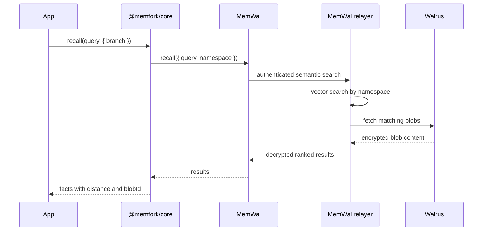
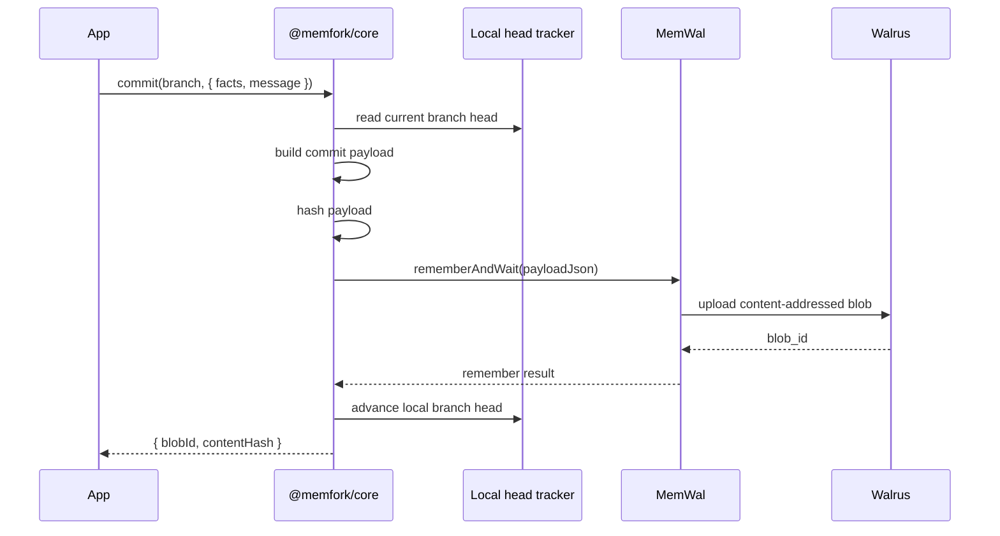
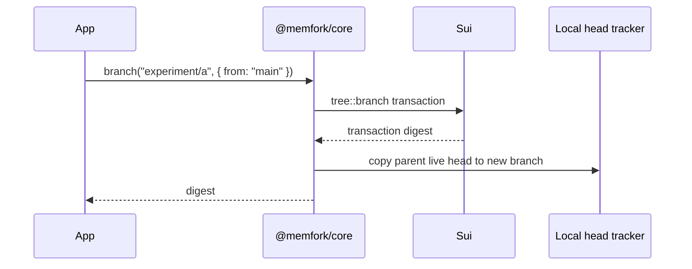
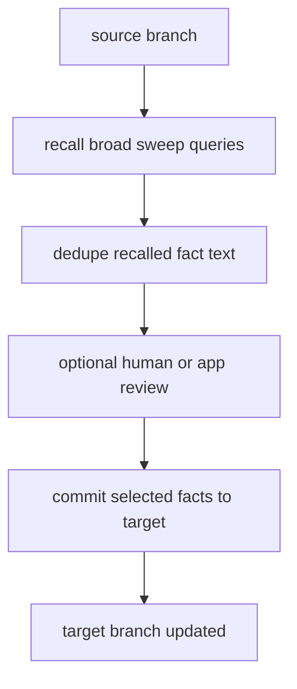
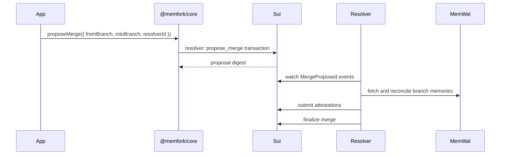
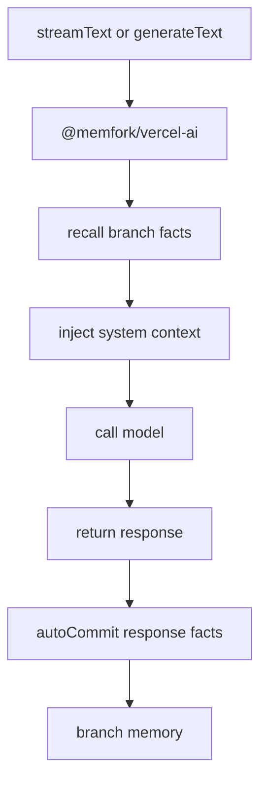
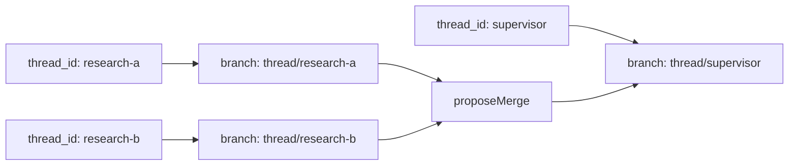

# Data Flows

This page shows the main runtime flows in MemForks.

## Recall

Recall is semantic search scoped to a branch.

## Commit

Commit writes a JSON payload through MemWal. It does not require a Sui transaction for every fact.

## Branch

Branch creation is on-chain because it changes the `MemoryTree`.

The new branch inherits the parent's head without copying memory blobs.

## Semantic Merge

Simple apps often implement a semantic cherry-pick merge.

This pattern is used by the reference chat app. It is not the full governed merge ceremony, but it is useful for product workflows.

## Governed Merge

Governed merges create an on-chain proposal and let a resolver settle the result.

## Vercel AI SDK Adapter

## LangGraph Checkpointer

Each LangGraph thread maps to a branch by default.

The checkpointer persists graph checkpoints through MemForks, so state can resume across processes and machines.
