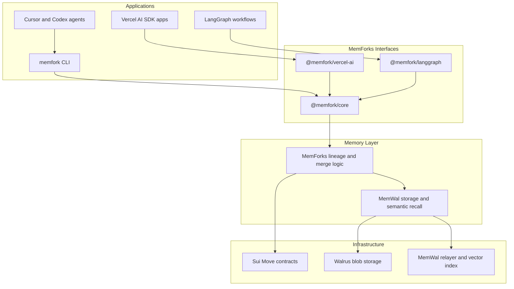
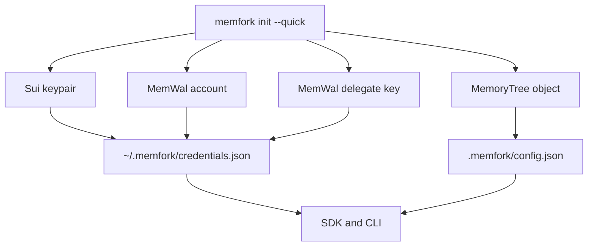

# Architecture

MemForks is a layered system: MemWal stores and recalls encrypted memories, while MemForks manages lineage, branch pointers, merge proposals, and permissions.

## Stack

## Components

### `@memfork/core`

The primary TypeScript SDK. It connects to Sui, MemWal, and optional gas sponsorship. It exposes:

- `MemForksClient.connect`
- `commit`
- `recall`
- `branch`
- `proposeMerge`
- delegate grant/revoke operations
- indexer utilities

### `@memfork/vercel-ai`

Middleware for the Vercel AI SDK. It recalls branch memory before generation and commits output after generation or streaming completes.

### `@memfork/langgraph`

A LangGraph checkpointer that maps graph threads to MemForks branches and stores checkpoint state through MemForks.

### `@memfork/cli`

Provisioning and operations tool:

- `memfork init --quick`
- `memfork doctor`
- `memfork branch`
- `memfork commit`
- `memfork recall`
- `memfork merge`
- IDE plugin installation

### MemWal

MemWal handles encrypted storage, embedding, vector search, Walrus upload/download, and restore. MemForks uses MemWal for the actual memory payloads.

### Sui Move Contracts

Contracts hold the `MemoryTree`, branch entries, delegates, resolver configuration, and merge proposal state. Sui is the audit and settlement layer, not the blob store.

## Package Map

| Package | Path | Role |
| --- | --- | --- |
| `@memfork/core` | `packages/core/` | TypeScript SDK and client |
| `@memfork/cli` | `packages/cli/` | `memfork` binary and config |
| `@memfork/vercel-ai` | `packages/vercel-ai/` | Vercel AI SDK middleware |
| `@memfork/langgraph` | `packages/langgraph/` | LangGraph checkpointer |
| Contracts | `contracts/` | Sui Move package |
| Sponsor | `services/sponsor/` | Gas sponsorship service |
| Chat example | `apps/memforks-chat/` | Next.js + Vercel AI reference |
| Research example | `apps/memforks-research/` | LangGraph reference workflow |

## Config And Authentication

The Sui private key signs branch, access, and merge transactions. The MemWal delegate key authorizes storage and recall through the relayer.
