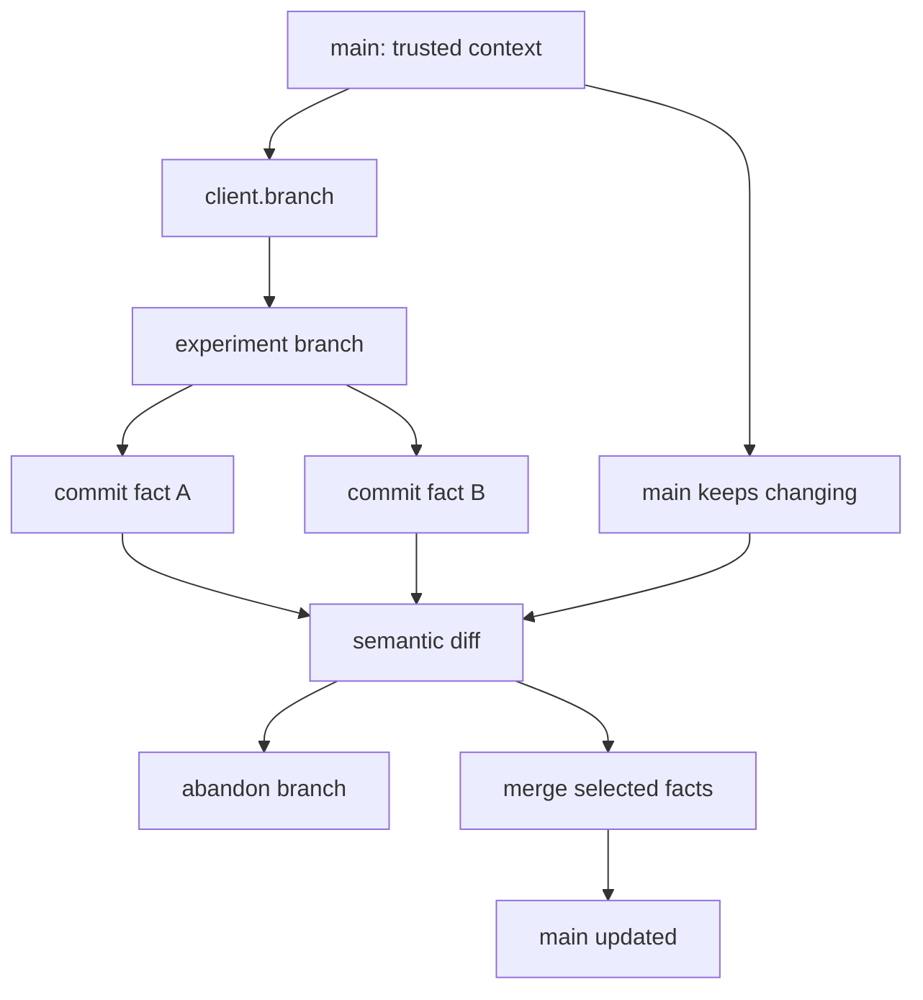

# Branching And Merging

MemForks branches let agents explore alternatives without corrupting trusted memory.

A branch inherits its parent's history at fork time. New commits on the branch are isolated until they are merged.

## Branch Naming

Branches are plain strings. Common conventions:

| Pattern | Use case |
| --- | --- |
| `main` | Trusted memory |
| `feature/auth` | Feature-specific work |
| `thread/<id>` | LangGraph thread mapping |
| `session/<id>` | User session mapping |
| `user/<userId>/main` | Multi-user namespace |
| `experiment/<name>` | Hypothesis or sandbox |

## Create A Branch

```ts
import { MemForksClient } from "@memfork/core";

const client = await MemForksClient.connect();

await client.branch("experiment/rust-rewrite", { from: "main" });
```

The branch operation is an on-chain transaction because it changes the `MemoryTree`.

## Commit To A Branch

```ts
const { blobId, contentHash } = await client.commit("experiment/rust-rewrite", {
  message: "record rust rewrite hypothesis",
  facts: [
    "Rust rewrite may reduce memory usage in the worker runtime.",
    "Rust rewrite increases onboarding cost for frontend contributors.",
  ],
});
```

Commits are Walrus blobs written through MemWal. They update the SDK's local head tracker and are cheap compared with merge settlement.

## Recall From A Branch

```ts
const facts = await client.recall("rewrite tradeoffs", {
  branch: "experiment/rust-rewrite",
  limit: 5,
});
```

Recall searches the MemWal namespace for that branch. The fork can recall inherited parent context and its own new facts, while unrelated branches stay isolated.

## Diff Branches

A semantic diff is usually implemented by recalling the same query on both branches, then comparing normalized fact text.

```ts
const [source, target] = await Promise.all([
  client.recall("architecture decisions", { branch: "experiment/rust-rewrite", limit: 10 }),
  client.recall("architecture decisions", { branch: "main", limit: 10 }),
]);
```

The reference chat app uses this pattern in its memory diff panel.

## Semantic Merge

For simple apps, a semantic merge can be implemented as:

1. Recall several broad queries from the source branch.
2. Deduplicate facts.
3. Commit the selected facts to the target branch.

```ts
const queries = [
  "project decisions",
  "user preferences",
  "technical tradeoffs",
];

const batches = await Promise.all(
  queries.map((query) => client.recall(query, { branch: "experiment/rust-rewrite", limit: 10 })),
);

const facts = Array.from(
  new Set(batches.flat().map((fact) => fact.text.trim()).filter(Boolean)),
);

await client.commit("main", {
  message: "merge facts from experiment/rust-rewrite",
  facts,
});
```

This is useful for demos and product workflows where the app controls the merge. For governed merges, use `proposeMerge`.

## Governed Merge

```ts
const digest = await client.proposeMerge({
  fromBranch: "experiment/rust-rewrite",
  intoBranch: "main",
  resolverId: process.env.MEMFORK_RESOLVER_ID!,
});
```

A resolver can reconcile facts, collect attestations, and finalize the merge on-chain.

## Branch Lifecycle



Rejected branches remain queryable. That is often the point: agents can remember why an idea lost without teaching the trusted branch that the losing idea is true.
