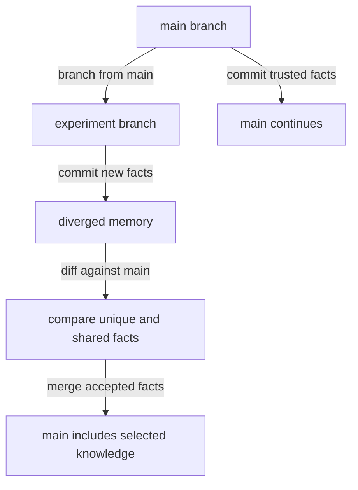

# Concepts Overview

MemForks is built on top of MemWal. The distinction matters:

- **MemWal** stores and recalls memories.
- **MemForks** versions, branches, and merges them.

MemWal is the filesystem. MemForks is Git.

## Layer Responsibilities

| Layer | Responsibility |
| --- | --- |
| MemWal | Encrypted Walrus blob storage, embedding, indexing, semantic recall, restore |
| MemForks Core | Branches, commit payloads, head tracking, merge proposals, delegates |
| Sui Move contracts | `MemoryTree`, access control, resolver objects, merge settlement |
| Adapters | Vercel AI middleware and LangGraph checkpointer |
| CLI | Provisioning, config, branch operations, status, logs, plugins |

## Why Branches Matter

A flat semantic memory namespace can answer "what did I remember?"

A branch-aware memory system can answer more:

- Which branch learned this?
- Did this fact come from the trusted main path or an abandoned hypothesis?
- What did the branch inherit at fork time?
- What did the branch learn after it diverged?
- Which facts should merge back?
- Who is allowed to merge them?

## Core Objects

### MemoryTree

A Sui object representing the versioned memory tree. It owns branch pointers, access rules, and merge state.

### Branch

A named line of memory history. A branch points to a head blob and maps to a MemWal namespace.

### Commit Blob

A content-addressed Walrus blob containing a JSON payload:

```json
{
  "v": 1,
  "type": "commit",
  "branch": "main",
  "parent_blob_ids": ["..."],
  "parent_blob_hashes": ["..."],
  "delta": {
    "facts": ["The actual memory fact"]
  }
}
```

### Merge Proposal

An on-chain object that records intent to merge one branch into another through a resolver. Resolvers can implement policies such as union, last-write-wins, jury reconciliation, or LLM reconciliation.

## MemWal vs MemForks

| Concern | MemWal | MemForks |
| --- | --- | --- |
| Store memory text | Yes | Delegates to MemWal |
| Semantic recall | Yes | Delegates to MemWal per branch |
| Encrypted storage | Yes | Uses MemWal encryption and storage |
| Flat namespace | Yes | Uses branch-derived namespaces |
| Branch lineage | No | Yes |
| Fork from parent | No | Yes |
| Diff related histories | No | Yes |
| Merge governance | No | Yes |
| Delegate permissions | Partial storage auth | Branch/tree permissions |
| Sui audit trail | Storage/account layer | Branches, access, merge settlement |

## Typical Lifecycle



## When To Use MemForks

Use MemForks when memory lineage is product-critical:

- Agent workspaces
- Draft variants
- Hypothesis exploration
- Multi-agent research
- Forked user sessions
- Auditable decisions
- Merge-reviewed memory
- Delegated agent permissions

If all you need is a single persistent memory namespace with semantic recall, MemWal alone may be enough. Use MemForks when the history and branch relationships are part of the value.
