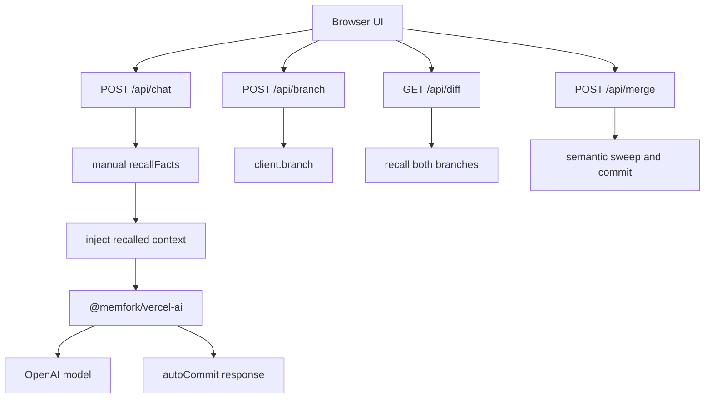

# Branch-Aware Chat Example

`apps/memforks-chat` is a Next.js 15 reference app that demonstrates the full MemForks browser experience with the Vercel AI SDK.

## What It Shows

| Feature | What to test |
| --- | --- |
| Persistent memory | Start a fresh chat and ask what the assistant remembers. |
| Branch isolation | Fork a reply and teach the fork a different fact. |
| Thread persistence | Switch branches and return to the previous visible thread. |
| Memory diff | Compare what a fork knows against `main`. |
| Merge | Promote recalled facts from a fork into `main`. |

## Run It

```bash
cd apps/memforks-chat
npm install
cp .env.example .env
npm run dev
```

Open `http://localhost:3001`.

Required environment:

```dotenv
OPENAI_API_KEY=sk-...
MEMFORK_TREE_ID=0x...
MEMFORK_PRIVATE_KEY=suiprivkey1...
MEMFORK_NETWORK=testnet
MEMFORK_MEMWAL_ACCOUNT=0x...
MEMFORK_MEMWAL_KEY=...
MEMFORK_RELAYER_URL=https://relayer.staging.memwal.ai
```

Use `memfork doctor --env` to print the MemForks values.

## Architecture



## Chat Flow

1. User sends a message with the active branch in the request body.
2. The route extracts the last user message as the recall query.
3. The app calls `recallFacts(query, branch)` manually so it can display recalled facts in the UI.
4. Recalled context is injected into the system prompt.
5. `withMemForks(openai(...), { autoCommit: true })` streams the answer.
6. The completed answer is committed to the active branch.
7. Recalled facts are returned in a response header for UI display.

## Branching Flow

On `main`, every assistant reply has **Branch from here**.

When clicked:

1. `POST /api/branch` creates a new branch from `main`.
2. The UI switches to the new `explore/<id>` branch.
3. The visible thread is trimmed to the branch point.
4. New memory commits go only to the fork.

## Diff Flow

The diff panel calls the same query on both branches:

```ts
const [fromFacts, intoFacts] = await Promise.all([
  recallFacts(query, from, 10),
  recallFacts(query, into, 10),
]);
```

The UI normalizes fact text and tags facts as `shared` or `unique`.

## Merge Flow

The demo merge is a semantic cherry-pick:

1. Recall broad queries from the source branch.
2. Deduplicate fact text.
3. Commit the result to `main`.

This is intentionally simpler than full `proposeMerge()` governance. It is useful for app-level "Promote to main" interactions.

## Multi-User Pattern

For production, do not share a naked `main` branch across users. Use a stable authenticated prefix:

```ts
function userBranch(userId: string, branch = "main") {
  return `user/${userId}/${branch}`;
}
```

See [Multi-User Apps](/guides/multi-user).
