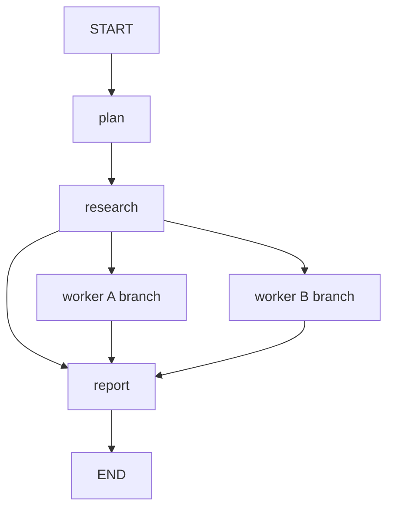

# LangGraph Research Example

`apps/memforks-research` is a multi-agent research pipeline built with LangGraph and `@memfork/langgraph`.

It demonstrates parallel agent branches, checkpointed graph state, compounding memory, and optional merge governance.

## What It Shows

| Feature | What to test |
| --- | --- |
| Checkpoint persistence | Kill and restart a run; graph state resumes from MemForks checkpoints. |
| Branch per worker | Each worker has its own thread branch. |
| Compounding memory | Run the same question twice; the second run recalls prior findings. |
| Supervisor synthesis | A supervisor branch combines worker findings. |
| Merge proposals | Worker findings can be proposed into the supervisor branch. |

## Run It

```bash
cd apps/memforks-research
npm install
cp .env.example .env
npm run research -- "What are the tradeoffs of microservices vs monoliths?"
```

Required environment:

```dotenv
OPENAI_API_KEY=sk-...
MEMFORK_TREE_ID=0x...
MEMFORK_PRIVATE_KEY=suiprivkey1...
MEMFORK_NETWORK=testnet
MEMFORK_MEMWAL_ACCOUNT=0x...
MEMFORK_MEMWAL_KEY=...
MEMFORK_RELAYER_URL=https://relayer.staging.memwal.ai
```

Optional:

```dotenv
TAVILY_API_KEY=tvly-...
MEMFORK_RESOLVER_ID=0x...
OPENAI_MODEL=gpt-4o
```

## Graph Shape



## Thread To Branch Mapping

| LangGraph thread ID | MemForks branch |
| --- | --- |
| `research-a` | `thread/research-a` |
| `research-b` | `thread/research-b` |
| `supervisor` | `thread/supervisor` |

With a fresh run, timestamped thread IDs can create brand-new branches. With stable IDs, repeated runs build on prior memory.

## Worker Loop

Each worker:

1. Recalls prior research on its topic from its thread branch.
2. Searches the web if `TAVILY_API_KEY` is available.
3. Falls back to model knowledge if search is unavailable.
4. Synthesizes new findings with prior context.
5. Commits the synthesis to its branch.

## Supervisor Loop

The supervisor:

1. Splits the question into complementary topics.
2. Starts workers in parallel.
3. Recalls prior supervisor-level synthesis.
4. Combines worker findings into a report.
5. Commits the report.
6. Optionally proposes worker-to-supervisor merges.

## Why MemForks Instead Of A Local Checkpointer?

| Local checkpointer | MemForks checkpointer |
| --- | --- |
| Process-local or file-local state | Walrus-backed persistent state |
| Hard to share across machines | Any configured machine can resume |
| No branch lineage | Thread branches inherit and diverge |
| No governed merge | `proposeMerge()` creates on-chain merge proposals |
| No durable audit trail | Checkpoints are content-addressed and branch-scoped |

## Minimal Checkpointer Setup

```ts
import { createMemForksCheckpointer } from "@memfork/langgraph";

const checkpointer = await createMemForksCheckpointer({
  treeId: process.env.MEMFORK_TREE_ID!,
  signer: process.env.MEMFORK_PRIVATE_KEY!,
  memwal: {
    accountId: process.env.MEMFORK_MEMWAL_ACCOUNT!,
    delegateKey: process.env.MEMFORK_MEMWAL_KEY!,
    serverUrl: process.env.MEMFORK_RELAYER_URL,
  },
  threadToBranch: (threadId) => `thread/${threadId}`,
});
```

Continue with [LangGraph Adapter](/sdk/langgraph) for SDK details.
