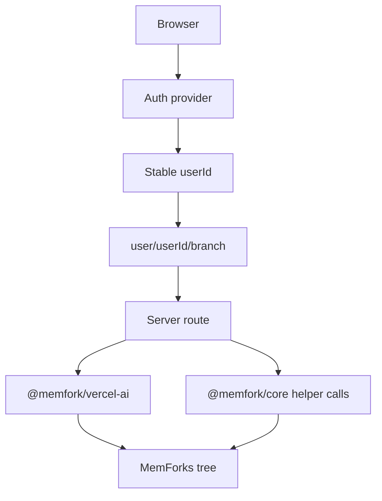

# Multi-User Apps

The reference apps use one memory tree from `.env` for a developer demo. Production apps need user isolation.

There are three common patterns.

## Option A: Server-Owned Tree, Per-User Branches

Recommended first step.

One tree is owned by the app's server keypair. Each authenticated user gets a branch namespace.

```ts
function userBranch(userId: string, branch = "main") {
  return `user/${userId}/${branch}`;
}

const branch = userBranch(session.userId);
```

Use this in route handlers:

```ts
const model = withMemForks(openai("gpt-4o-mini"), {
  ...memforkConfig,
  branch: userBranch(session.userId, activeBranch),
});
```

### Pros

- Fastest to build.
- Works with Privy, NextAuth, custom auth, or any stable user ID.
- No per-user Sui provisioning.
- No MemForks or MemWal config changes.

### Tradeoff

The app owns the tree. User portability requires an export or migration flow.

## Option B: App-Provisioned Tree Per User

On first login, create or provision a dedicated memory tree per user and store the `treeId` in your database.

```ts
async function getClientForUser(userId: string) {
  const user = await db.users.find(userId);

  return MemForksClient.connect({
    treeId: user.treeId,
    signer: process.env.MEMFORK_PRIVATE_KEY!,
    memwal: {
      accountId: user.memwalAccountId,
      delegateKey: user.memwalDelegateKey,
    },
  });
}
```

### Pros

- Stronger user ownership story.
- Easier portability.
- Cleaner isolation boundary.

### Tradeoff

Requires provisioning, persistence, and usually gas sponsorship.

## Option C: User-Owned Trees

The user runs:

```bash
memfork init --quick
```

Then they provide credentials or connect their own environment. This is best for developer tools, local agents, and power users.

### Pros

- Maximum user control.
- No app-owned private key.
- Fits self-hosted workflows.

### Tradeoff

Too much setup for mainstream consumer apps.

## Recommended Web App Architecture



## Branch Picker

In single-user demos, branch names can live in `localStorage`. In multi-user apps, branch lists should be server-scoped:

- list branches for `user/<userId>/`
- create branches under `user/<userId>/...`
- never trust a client-provided branch without checking the prefix

## Security Rules

- Keep `MEMFORK_PRIVATE_KEY` server-side.
- Keep `MEMFORK_MEMWAL_KEY` server-side.
- Derive branch names from authenticated server session data.
- Reject branch names outside the user's namespace.
- Do not expose raw credentials to the browser.

## Suggested First Implementation

Start with Option A:

1. Add auth.
2. Derive a stable `userId`.
3. Prefix every branch with `user/<userId>/`.
4. Keep the app-owned tree in environment variables.
5. Add export or migration later if portability becomes necessary.
