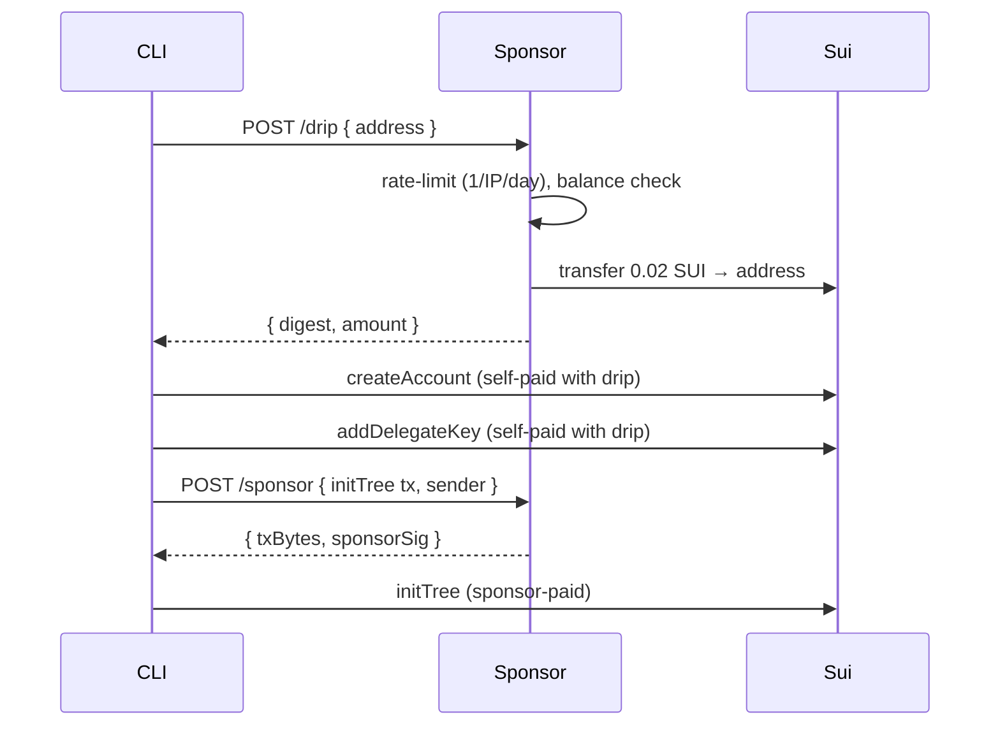
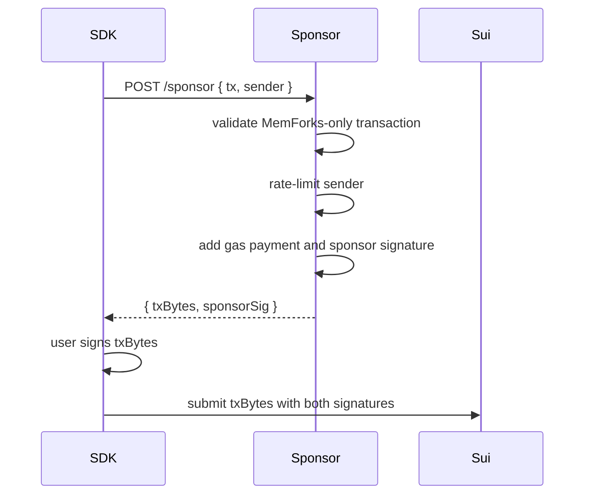

# Gas Sponsorship

The MemForks sponsor service covers all gas fees so developers can use MemForks on mainnet without holding any SUI.

It handles two distinct cases:

- **`/drip`** — sends a small SUI amount to a fresh address during `memfork init --quick` so the two MemWal bootstrap transactions (account creation and delegate key registration) can self-pay gas. This is a one-time transfer.
- **`/sponsor`** — co-signs all subsequent MemForks transactions (branch, commit, merge, etc.) so the user never needs gas again.

The user's address remains the transaction sender in both cases.

## How It Works

### Bootstrap drip (`memfork init --quick`)



### Ongoing sponsorship



## Service Setup

```bash
cd services/sponsor
npm install
cp .env.example .env
npm start
```

Required environment:

| Variable | Required | Default | Description |
| --- | --- | --- | --- |
| `SPONSOR_PRIVATE_KEY` | Yes | — | Sponsor wallet private key. |
| `SUI_NETWORK` | Yes | `mainnet` | `mainnet`, `testnet`, or `devnet`. |
| `SUI_RPC_URL` | No | auto | Override RPC endpoint. |
| `MEMFORK_PACKAGE_ID` | No | production ID | Allowed MemForks Move package ID. |
| `RATE_MAX_PER_WIN` | No | `10` | Max sponsored txs per sender per window. |
| `RATE_WINDOW_MS` | No | `60000` | Rate limit window in ms. |
| `RATE_IP_MAX_PER_WIN` | No | `40` | Max txs per IP per window. |
| `RATE_DAILY_MAX_TX` | No | `5000` | Global daily transaction cap. |
| `RATE_INIT_TREE_PER_IP_DAY` | No | `1` | Max tree creations per IP per day. |
| `SPONSOR_GAS_BUDGET` | No | `90000000` | Gas budget per tx in MIST. |
| `DRIP_AMOUNT_MIST` | No | `20000000` | SUI sent per `/drip` (0.02 SUI). |
| `DRIP_MIN_BALANCE_MIST` | No | `5000000` | Skip drip if address already has this. |
| `DRIP_IP_DAILY_MAX` | No | `1` | Max drips per IP per 24 h. |
| `PORT` | No | `3100` | HTTP port. |

## API

### Health

```http
GET /health
```

Returns:

```json
{ "ok": true, "network": "mainnet" }
```

### Bootstrap Drip

```http
POST /drip
```

Sends a small SUI amount to a fresh address so it can self-pay for the two MemWal bootstrap transactions during `memfork init --quick`. Called automatically by the CLI — you don't need to call this directly.

Request:

```json
{ "address": "0x<new address>" }
```

Success (drip sent):

```json
{ "digest": "<tx digest>", "amount": 20000000 }
```

Success (already funded, skipped):

```json
{ "skipped": true, "message": "address already has sufficient balance", "balance": "25000000" }
```

| Status | Meaning |
| --- | --- |
| `429` | Rate limit: 1 drip per IP per 24 h. |
| `500` | Sponsor wallet error. |

### Sponsor Transaction

```http
POST /sponsor
```

Request:

```json
{
  "tx": "<serialized Transaction string>",
  "sender": "0x<user address>"
}
```

Success:

```json
{
  "txBytes": "<base64>",
  "sponsorSig": "<base64 signature>"
}
```

Common errors:

| Status | Meaning |
| --- | --- |
| `400` | Invalid transaction or disallowed package call. |
| `429` | Sender exceeded rate limit. |
| `503` | Sponsor gas pool unavailable. |

## Configure The SDK

The CLI sets this automatically. For SDK usage in your own app:

```bash
export MEMFORK_SPONSOR_URL=https://memforks-sponsor-production.up.railway.app/sponsor
```

Or explicitly in code:

```ts
const client = await MemForksClient.connect({
  treeId,
  signer,
  memwal,
  sponsorUrl: "https://memforks-sponsor-production.up.railway.app/sponsor",
});
```

::: tip
`MEMFORK_SPONSOR_URL` must point to the full `/sponsor` endpoint path. The SDK POSTs directly to the URL with no path appended.
:::

## Funding The Sponsor

Each MemForks transaction is small, but high-concurrency services should pre-split SUI into multiple gas coins to avoid contention.

```bash
sui client split-coin \
  --coin-id <COIN_ID> \
  --amounts 20000000 20000000 20000000 \
  --gas-budget 10000000
```

## Deployment Notes

- The service is stateless.
- Deploy on Railway, Fly.io, a VPS, or any Node.js host.
- Keep `SPONSOR_PRIVATE_KEY` in a secret manager.
- Use an external rate limiter such as Redis if you scale horizontally.
- Restrict sponsored calls to the expected MemForks package.
