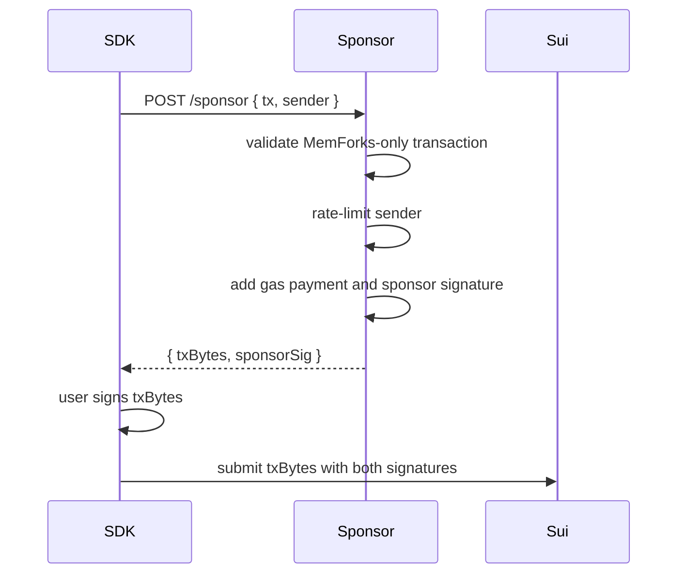

# Gas Sponsorship

The MemForks sponsor service co-signs Sui transactions so users can use MemForks on mainnet without holding SUI for gas.

The user's address remains the transaction sender. The sponsor only pays gas.

## How It Works



## Service Setup

```bash
cd services/sponsor
npm install
cp .env.example .env
npm start
```

Required environment:

| Variable | Required | Description |
| --- | --- | --- |
| `SPONSOR_PRIVATE_KEY` | Yes | Sponsor wallet private key. |
| `SUI_NETWORK` | Yes | `mainnet`, `testnet`, or `devnet`. |
| `SUI_RPC_URL` | No | Override RPC endpoint. |
| `MEMFORK_PACKAGE_ID` | No | Allowed MemForks Move package ID. |
| `RATE_MAX_PER_WIN` | No | Max sponsored transactions per sender per window. |
| `RATE_WINDOW_MS` | No | Rate limit window. |
| `SPONSOR_GAS_BUDGET` | No | Gas budget per transaction in MIST. |
| `PORT` | No | HTTP port. |

## API

### Health

```http
GET /health
```

Returns:

```json
{ "ok": true, "sponsor": "0x..." }
```

### Sponsor Transaction

```http
POST /sponsor
```

Request:

```json
{
  "tx": "<serialized Transaction string>",
  "sender": "0x<user address>"
}
```

Success:

```json
{
  "txBytes": "<base64>",
  "sponsorSig": "<base64 signature>"
}
```

Common errors:

| Status | Meaning |
| --- | --- |
| `400` | Invalid transaction or disallowed package call. |
| `429` | Sender exceeded rate limit. |
| `503` | Sponsor gas pool unavailable. |

## Configure The SDK

Environment variable:

```bash
export MEMFORK_SPONSOR_URL=https://sponsor.your-domain.com
```

Explicit SDK config:

```ts
const client = await MemForksClient.connect({
  treeId,
  signer,
  memwal,
  sponsorUrl: "https://sponsor.your-domain.com",
});
```

## Funding The Sponsor

Each MemForks transaction is small, but high-concurrency services should pre-split SUI into multiple gas coins to avoid contention.

```bash
sui client split-coin \
  --coin-id <COIN_ID> \
  --amounts 20000000 20000000 20000000 \
  --gas-budget 10000000
```

## Deployment Notes

- The service is stateless.
- Deploy on Railway, Fly.io, a VPS, or any Node.js host.
- Keep `SPONSOR_PRIVATE_KEY` in a secret manager.
- Use an external rate limiter such as Redis if you scale horizontally.
- Restrict sponsored calls to the expected MemForks package.
