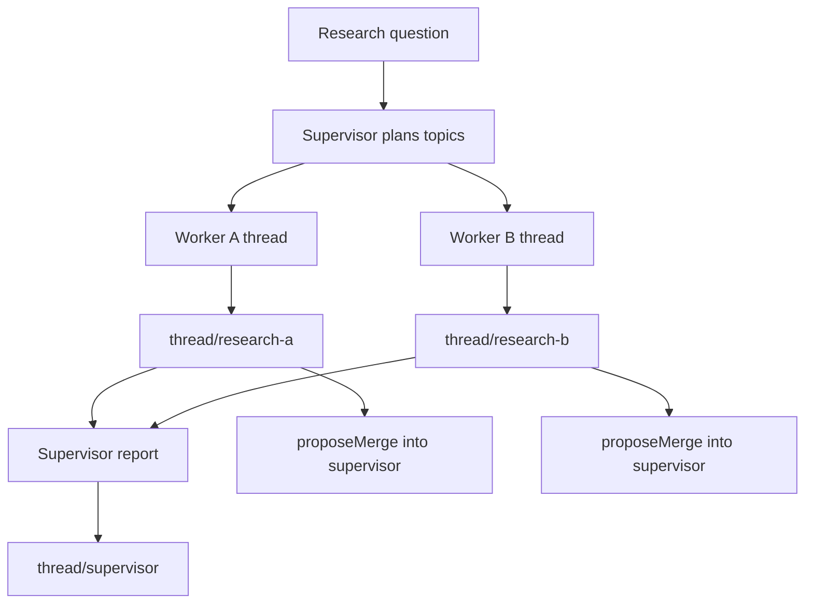

# LangGraph Adapter

`@memfork/langgraph` is a LangGraph checkpointer backed by MemForks.

Each graph thread maps to a MemForks branch. Checkpoints are committed through MemForks, so graph state can persist across runs, processes, and machines.

## Install

```bash
npm install @memfork/langgraph @memfork/core @langchain/langgraph
```

Provision credentials:

```bash
memfork init --quick
```

## Basic Usage

```ts
import { StateGraph, MessagesAnnotation } from "@langchain/langgraph";
import { createMemForksCheckpointer } from "@memfork/langgraph";

const checkpointer = await createMemForksCheckpointer({
  treeId: process.env.MEMFORK_TREE_ID!,
  signer: process.env.MEMFORK_PRIVATE_KEY!,
  memwal: {
    accountId: process.env.MEMFORK_MEMWAL_ACCOUNT!,
    delegateKey: process.env.MEMFORK_MEMWAL_KEY!,
    serverUrl: process.env.MEMFORK_RELAYER_URL,
  },
});

const app = new StateGraph(MessagesAnnotation)
  .addNode("agent", myAgentNode)
  .addEdge("__start__", "agent")
  .compile({ checkpointer });

await app.invoke(
  { messages: [{ role: "user", content: "Hello" }] },
  { configurable: { thread_id: "abc123" } },
);
```

By default, `thread_id: "abc123"` maps to branch `thread/abc123`.

## Custom Thread-To-Branch Mapping

```ts
const checkpointer = await createMemForksCheckpointer({
  treeId,
  signer,
  memwal,
  threadToBranch: (threadId) => `agent/${threadId}`,
});
```

Use stable thread IDs when you want future runs to build on previous graph state.

## How It Works

| LangGraph event | MemForks behavior |
| --- | --- |
| `put()` checkpoint | Commits serialized checkpoint state to the thread branch. |
| `getTuple()` | Recalls checkpoint state for the thread. |
| `putWrites()` | Commits pending writes to branch memory. |
| `proposeMerge()` | Opens a MemForks merge proposal between thread branches. |

## Multi-Agent Branches



This pattern lets parallel workers accumulate knowledge independently, then merge their findings into a supervisor branch.

## Cross-Agent Merge

```ts
const digest = await checkpointer.proposeMerge({
  fromThread: "research-a",
  intoThread: "supervisor",
  resolverId: process.env.MEMFORK_RESOLVER_ID!,
});
```

The resolver handles reconciliation and finalization.

## When To Use LangGraph

Use the LangGraph adapter when your app has:

- multi-step workflows
- parallel worker agents
- resumable graph state
- long-running tasks
- branch-per-thread memory
- checkpoint recovery after process restarts
- governed merges between agents

For simple chat apps, use the [Vercel AI SDK adapter](/sdk/vercel-ai).

## Reference Example

See [LangGraph Research](/examples/research) for a multi-agent research pipeline using worker branches and supervisor merges.
